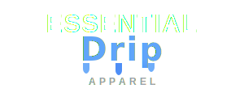
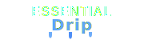

# Essential Drip Apparel - Logo Guide

## Logo Versions

### 1. **logo.svg** - Full Logo (Transparent)
- **Size**: 300×120px
- **Use**: Website headers, hero sections, light backgrounds
- **Features**: 
  - "ESSENTIAL" in bold white sans-serif
  - "Drip" in stylish font with light blue gradient
  - Animated liquid drip effects
  - "APPAREL" in small gray uppercase

### 2. **logo-dark.svg** - Full Logo (Dark Background)
- **Size**: 300×120px
- **Use**: Dark sections, social media, presentations
- **Features**: 
  - Dark background (#0A0A0A) with rounded corners
  - Same design as transparent version
  - Better visibility on light backgrounds

### 3. **logo-compact.svg** - Compact Version
- **Size**: 180×50px
- **Use**: Navigation bar, mobile header, favicon base
- **Features**: 
  - Smaller proportions
  - No "APPAREL" text
  - Optimized for small spaces

## Color Palette

### Primary Colors
- **Light Blue**: #60A5FA (Primary accent)
- **Navy Blue**: #3B82F6 (Gradient end)
- **White**: #FFFFFF (Text)
- **Gray**: #9CA3AF (Subtitle)
- **Dark**: #0A0A0A (Background)

### Gradient
```css
linear-gradient(180deg, #60A5FA 0%, #3B82F6 100%)
```

## Typography

### "ESSENTIAL"
- **Font**: Arial, Helvetica, sans-serif
- **Weight**: 900 (Black)
- **Size**: 32px (full), 16px (compact)
- **Color**: White (#FFFFFF)
- **Letter Spacing**: 1px

### "Drip"
- **Font**: Brush Script MT, cursive, sans-serif
- **Weight**: 700 (Bold)
- **Size**: 40px (full), 20px (compact)
- **Color**: Gradient (Light Blue to Navy)
- **Letter Spacing**: 2px (full), 1px (compact)
- **Effect**: Glow filter

### "APPAREL"
- **Font**: Arial, Helvetica, sans-serif
- **Weight**: 600 (Semi-bold)
- **Size**: 12px
- **Color**: Gray (#9CA3AF)
- **Letter Spacing**: 4px
- **Transform**: Uppercase

## Animated Drip Effects

### Features
- 3 liquid drops beneath "Drip" text
- Smooth animation (2-2.5s duration)
- Staggered timing for natural effect
- Colors alternate between light blue and navy

### Animation Details
```
Drip 1: 2.0s duration, 0s delay
Drip 2: 2.3s duration, 0.3s delay
Drip 3: 2.5s duration, 0.6s delay
```

## Usage Guidelines

### ✅ Do's
- Use on dark backgrounds for best visibility
- Maintain aspect ratio when scaling
- Keep clear space around logo (minimum 20px)
- Use compact version for small spaces (< 200px width)
- Ensure drip animations are visible

### ❌ Don'ts
- Don't change colors outside brand palette
- Don't remove the drip effects
- Don't stretch or distort proportions
- Don't add drop shadows (glow is built-in)
- Don't use on busy backgrounds

## File Formats

### SVG (Scalable Vector Graphics)
- **Advantages**: Scalable, small file size, animated
- **Use**: Web, digital applications
- **Support**: All modern browsers

### Converting to Other Formats
- **PNG**: Export at 2x resolution for retina displays
- **PDF**: For print materials and clothing tags
- **Favicon**: Use compact version, export at 32×32, 64×64, 128×128

## Integration Examples

### HTML
```html
<!-- Full logo -->


<!-- Compact logo (navbar) -->


<!-- Dark background version -->

```

### CSS Background
```css
.logo {
  background-image: url('images/logo.svg');
  background-size: contain;
  background-repeat: no-repeat;
  width: 300px;
  height: 120px;
}
```

## Responsive Sizing

### Desktop
- Header: 300×120px (full logo)
- Navbar: 180×50px (compact)

### Tablet
- Header: 240×96px (scaled full)
- Navbar: 150×42px (scaled compact)

### Mobile
- Header: 180×72px (scaled full)
- Navbar: 120×33px (scaled compact)

## Brand Applications

### Website
- Hero section header
- Navigation bar
- Footer
- Loading screens

### Print
- Clothing tags
- Business cards
- Packaging
- Promotional materials

### Social Media
- Profile pictures (use dark version)
- Cover photos
- Post watermarks
- Story highlights

## Technical Specifications

### SVG Features
- Viewbox: Maintains aspect ratio
- Animations: CSS-based, smooth
- Filters: Glow effect for depth
- Gradients: Linear, top to bottom

### Performance
- File size: ~2-3KB (optimized)
- Load time: Instant
- Animation: Hardware accelerated
- Browser support: 99%+

---

**Created for Essential Drip Apparel**  
Modern Streetwear Brand  
Premium • Minimal • Authentic
